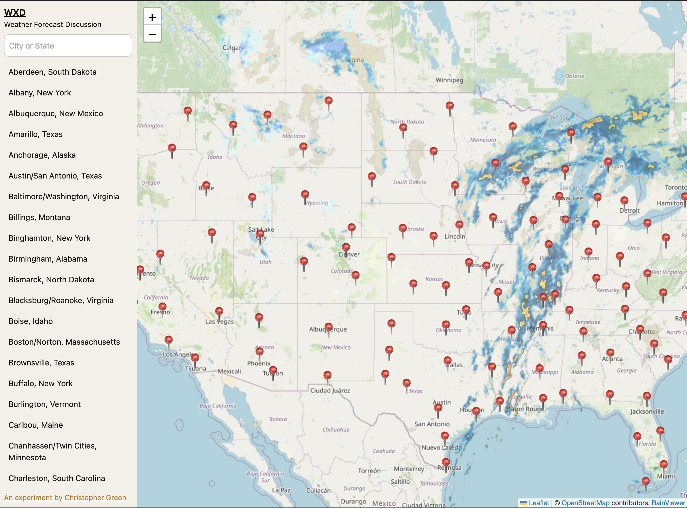
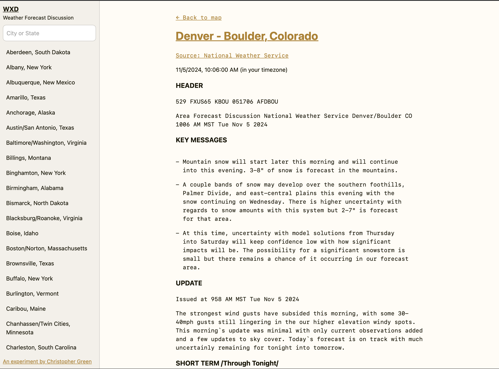

# WXD

An experimental website for reading National Weather Service [area forecast discussions](https://forecast.weather.gov/product.php?site=PSR&issuedby=PSR&product=AFD&format=ci&version=1&glossary=1).

## Why

- It is difficult to find area forecast discussions
- It is difficult to read area forecast discussions on mobile devices
- I needed a toy website to experiment with web components

## Getting started

1. Clone this repository
2. Run `npm install`
3. Run `npm run dev` for local development
4. Run `npm run build` to build for production

## Links

- [cgreen](https://c9r.green)
- [National Weather Service](https://www.weather.gov)
- [LeafletJS](https://leafletjs.com)
- [Rainviewer](https://www.rainviewer.com)
- [MDN - Web Components](https://developer.mozilla.org/en-US/docs/Web/API/Web_components)
- [Eleventy](https://www.11ty.dev)
